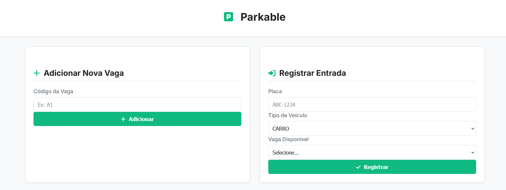
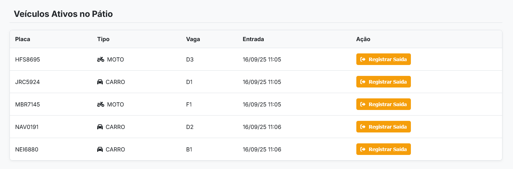
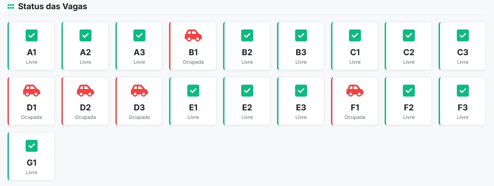

# Parkable - Sistema de Gerenciamento de Estacionamento


Aplicação web full-stack para gerenciamento de um estacionamento, desenvolvida como um projeto de estudo para demonstrar habilidades no ecossistema Java e Spring. O projeto conta com uma API REST completa para todas as operações e um dashboard web interativo para visualização e controle em tempo real.

---

## 📸 Visão Geral da Interface

A aplicação conta com um dashboard limpo e moderno, que centraliza todas as operações do estacionamento.

#### **Formulários de Ação**
*Formulários para adicionar novas vagas e registrar a entrada de veículos de forma rápida e intuitiva.*


#### **Veículos Ativos no Pátio**
*Tabela com todos os veículos atualmente estacionados, permitindo o registro de saída com um único clique.*


#### **Status das Vagas**
*Visualização em grid de todas as vagas do estacionamento, com status (Livre/Ocupada) indicado por cores e ícones.*


#### **Histórico de Saídas**
*Registro completo de todos os veículos que já passaram pelo estacionamento, ordenado dos mais recentes para os mais antigos.*


---

## 📜 Descrição Completa

Parkable é uma solução robusta para o controle de pátios de estacionamento. A aplicação permite o gerenciamento completo do ciclo de vida de uma vaga, desde o cadastro e visualização de status até o registro de entrada e saída de veículos. A lógica de negócio inclui cálculo de preço baseado no tempo de permanência e um histórico detalhado de todas as operações.

O backend foi construído seguindo as melhores práticas de design de APIs REST, utilizando o padrão DTO (Data Transfer Object) e Mappers para desacoplar a camada de API do modelo de persistência de dados. O frontend, renderizado no lado do servidor com Thymeleaf, oferece uma interface de usuário limpa, moderna e responsiva para interagir com o sistema.

## 🚀 Funcionalidades

-   [x] **API REST Completa:** Endpoints para todas as operações de CRUD de Vagas e Registros de Estacionamento.
-   [x] **Dashboard Interativo:** Interface web com Thymeleaf para visualização e gerenciamento em tempo real.
-   [x] **Controle de Vagas:** Adição e exclusão de vagas, com visualização de status (Livre/Ocupada).
-   [x] **Registro de Veículos:** Formulários para registrar a entrada de carros e motos, com seleção dinâmica de vagas livres.
-   [x] **Finalização de Estadia:** Funcionalidade para registrar a saída de veículos com um único clique.
-   [x] **Cálculo Automático de Preço:** Lógica de negócio que calcula o valor a ser pago com base no tempo de permanência.
-   [x] **Histórico de Operações:** Tabela com o histórico de todos os veículos que já saíram, ordenada dos mais recentes para os mais antigos.

## 💪 Desafios Superados

Durante o desenvolvimento, vários desafios foram superados, servindo como grandes pontos de aprendizado:

-   **Design de API REST:** Aprofundamento no uso correto dos verbos HTTP (`POST`, `PUT`, `DELETE`), códigos de status (`201`, `204`, `404`) e design de URLs semânticas.
-   **Padrão DTO e Mapeamento:** Implementação do padrão DTO para desacoplar as camadas da aplicação, garantindo segurança e flexibilidade. Utilização da biblioteca **MapStruct** para automatizar o mapeamento entre Entidades e DTOs, incluindo casos complexos de mapeamento de objetos aninhados.
-   **Configuração de Build (Maven):** Resolução de problemas complexos de configuração do `pom.xml`, incluindo a configuração correta do `maven-compiler-plugin` para o MapStruct e a resolução de conflitos de filtragem de recursos (`maven-resources-plugin`) com os placeholders do Spring Boot.
-   **Thymeleaf Dinâmico:** Criação de uma interface rica com renderização condicional (`th:if`, `th:switch`), iteração sobre listas (`th:each`), formatação de datas e números, e estilização dinâmica com `th:classappend`.

## 🛠️ Tecnologias Utilizadas

-   **Backend:**
    -   Java 21
    -   Spring Boot 3
    -   Spring Web
    -   Spring Data JPA / Hibernate
-   **Frontend:**
    -   Thymeleaf
    -   HTML5
    -   CSS3
-   **Banco de Dados:**
    -   H2 Database (In-Memory & File-based)
-   **Build & Dependências:**
    -   Apache Maven
    -   Lombok
    -   MapStruct

## ⚙️ Instalação e Uso

Para executar este projeto localmente, siga os passos abaixo:

1.  **Clone o repositório:**
    ```bash
    git clone [https://github.com/lucass-barreto/seu-repositorio.git](https://github.com/lucass-barreto/seu-repositorio.git)
    cd seu-repositorio
    ```

2.  **Pré-requisitos:**
    * Java (JDK) 21 instalado.
    * Apache Maven instalado.

3.  **Build do Projeto:**
    Execute o comando Maven para construir o projeto. Isso irá baixar as dependências e gerar as classes do MapStruct.
    ```bash
    mvn clean install
    ```

4.  **Execute a Aplicação:**
    Inicie a aplicação através da sua IDE, executando a classe principal `ParkableApplication.java`, ou via terminal:
    ```bash
    java -jar target/Parkable-0.0.1-SNAPSHOT.jar
    ```

5.  **Acesse a Aplicação:**
    * **Interface Web (Dashboard):** [http://localhost:8080/ui/dashboard](http://localhost:8080/ui/dashboard)
    * **API REST (Exemplos):**
        * `GET http://localhost:8080/vagas`
        * `GET http://localhost:8080/estacionamento`
    * **Console do Banco H2:** [http://localhost:8080/h2-console](http://localhost:8080/h2-console) (Use as credenciais do `application.properties` se necessário).

## 📫 Contato

**Lucas Barreto Oliveira**

* **GitHub:** [@lucass-barreto](https://github.com/lucass-barreto)
* **LinkedIn:** [@lucass-barreto](https://www.linkedin.com/in/lucass-barreto)
* **Email:** lucasbo.dev@gmail.com